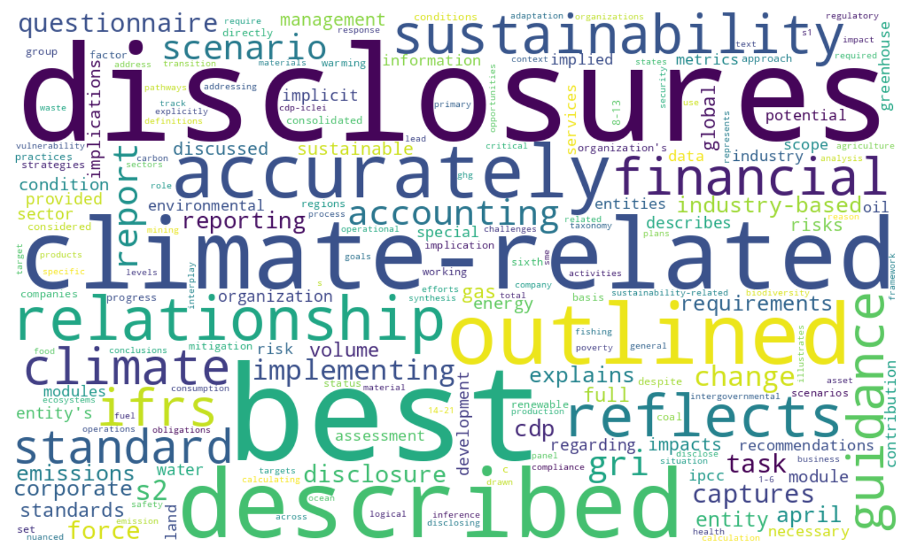
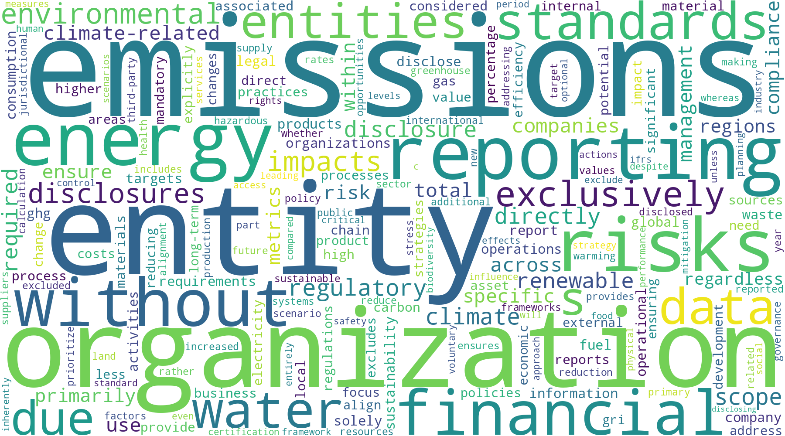
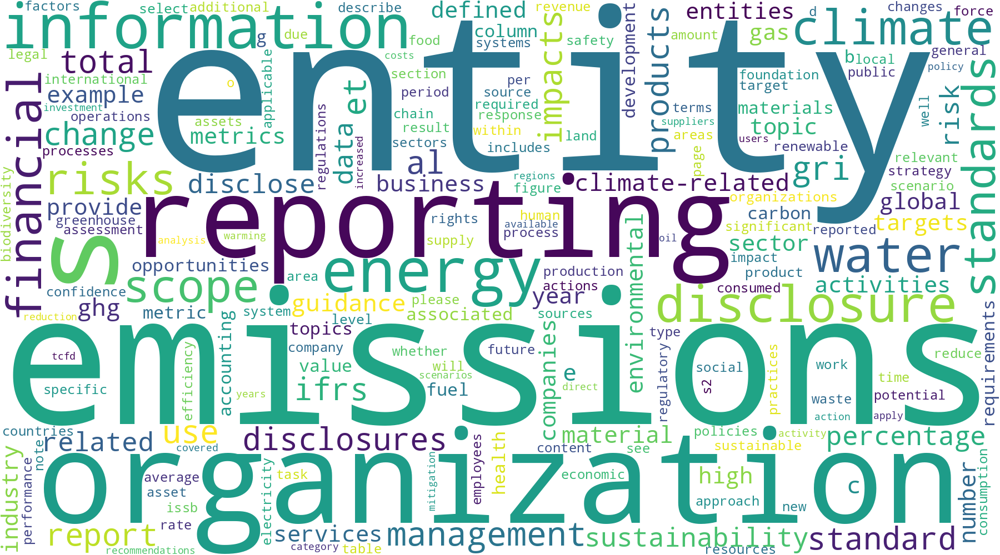
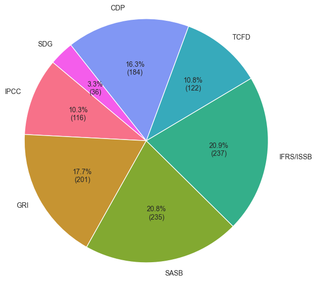
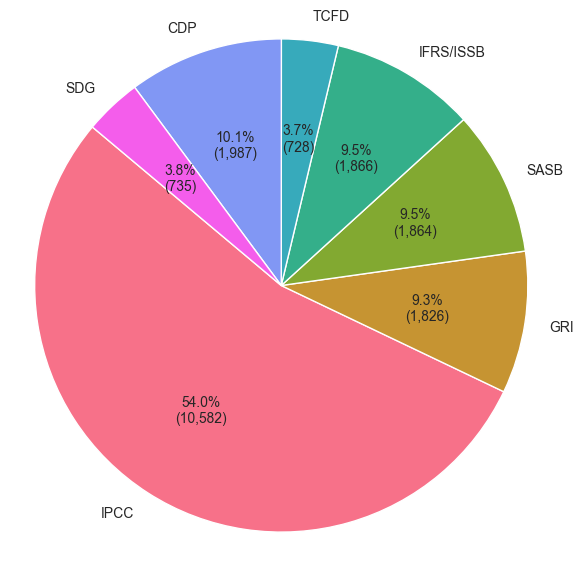
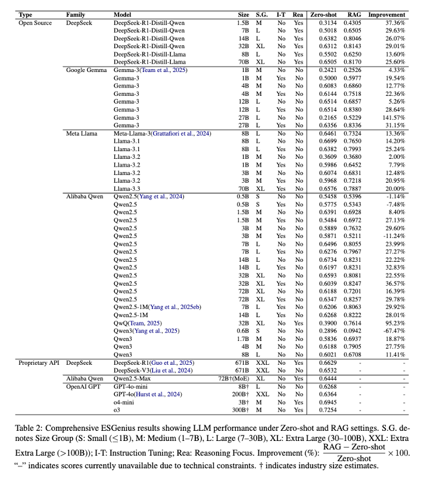
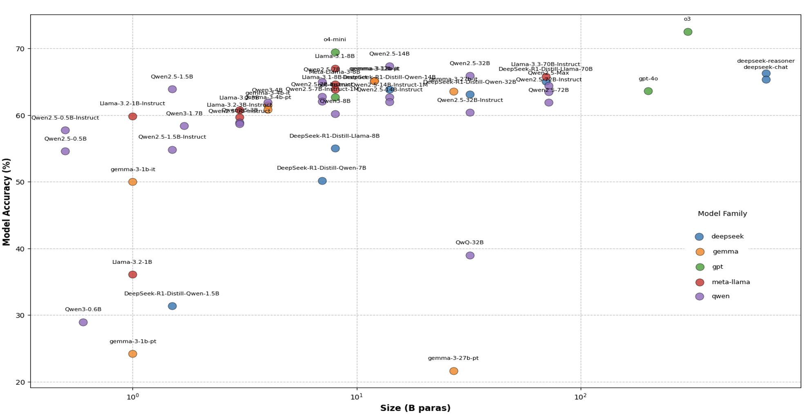

# ESGenius Benchmark

This repository contains the dataset and evaluation code released with the **ESGenius** paper.  The benchmark focuses on question answering within the domains of Environmental, Social and Governance (ESG) and sustainability.  The full paper is provided as [`ESGenius_arxiv_v1.pdf`](ESGenius_arxiv_v1.pdf).

## Dataset

The dataset consists of 1,136 multiple-choice questions covering a range of ESG frameworks such as IPCC, GRI, SASB, ISO, IFRS/ISSB, TCFD and CDP. Each question provides four answer options (A–D) plus a fallback choice `Z` for "Not sure". The plain question set is stored in [`data/ESGenius_1136q.csv`](data/ESGenius_1136q.csv) and [`data/ESGenius_1136q.json`](data/ESGenius_1136q.json). A version with references is available as [`data/ESGenius_w_ref_1136q.csv`](data/ESGenius_w_ref_1136q.csv) and includes page numbers, document names and the original text snippet.

Example header from the reference file:

```csv
"query_id","new_id","query","answer","A","B","C","D","Z","ref_page","ref_doc","source_text"
```
【F:data/ESGenius_w_ref_1136q.csv†L1-L1】

## Repository Layout

- **`evaluation_utils.py`** – common utilities for loading data, building prompts, computing metrics and saving results. It also loads API keys from a `.env` file:

  ```python
  load_dotenv()
  HF_TOKEN = os.getenv("HF_TOKEN")
  DEEPSEEK_API_KEY = os.getenv("DEEPSEEK_API_KEY")
  DASHSCOPE_API_KEY = os.getenv("DASHSCOPE_API_KEY")
  OPENAI_API_KEY = os.getenv("OPENAI_API_KEY")
  ```
  【F:evaluation_utils.py†L36-L46】

- **`eval_opensource.py`** – evaluates open‑source Hugging Face models locally using GPU acceleration.
- **`eval_opensource_rag.py`** – adds a minimal retrieval‑augmented generation (RAG) step before generation.
- **`eval_qwen_api.py`** – evaluates Qwen models through the Dashscope API.
- **`index.html`** – interactive heatmap visualising results for 1,136 questions:

  ```html
  <h1>ESGenius_1136q - Interactive Evaluation Heatmap</h1>
  <p>
      This report visualizes the evaluation results for <b>50</b> models tested on <b>1136</b> questions from the <b>ESGenius_1136q</b> benchmark dataset.
  ```
  【F:index.html†L27-L35】

- **`figures/`** – images of word clouds and summary plots used in the paper.

## Figures

The following figures summarise the dataset and results:












## Running Evaluations

1. Install dependencies (PyTorch, Transformers, pandas, etc.).
2. Create a `.env` file with the required API tokens (`HF_TOKEN`, `DASHSCOPE_API_KEY`, etc.).
3. Run one of the evaluation scripts:

```bash
python eval_opensource.py        # evaluate local open‑source models
python eval_opensource_rag.py    # evaluate with RAG retrieval
python eval_qwen_api.py          # evaluate Qwen via Dashscope API
```

Results are written to the `results/` directory as Excel workbooks containing a summary sheet and detailed predictions.

## License

This project is licensed under the [Apache 2.0 License](LICENSE).

For full details of the benchmark and experimental setup, please refer to the accompanying paper `ESGenius_arxiv_v1.pdf`.
